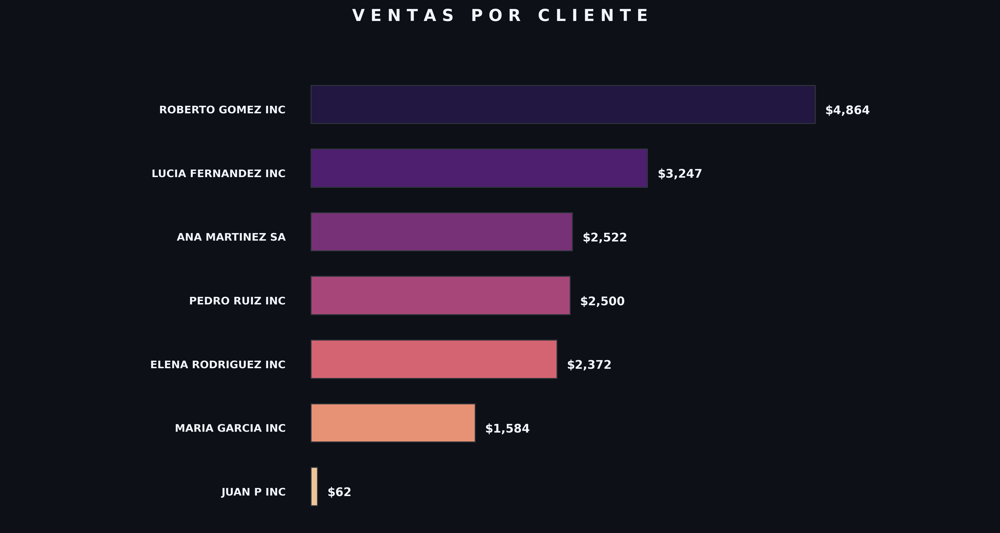
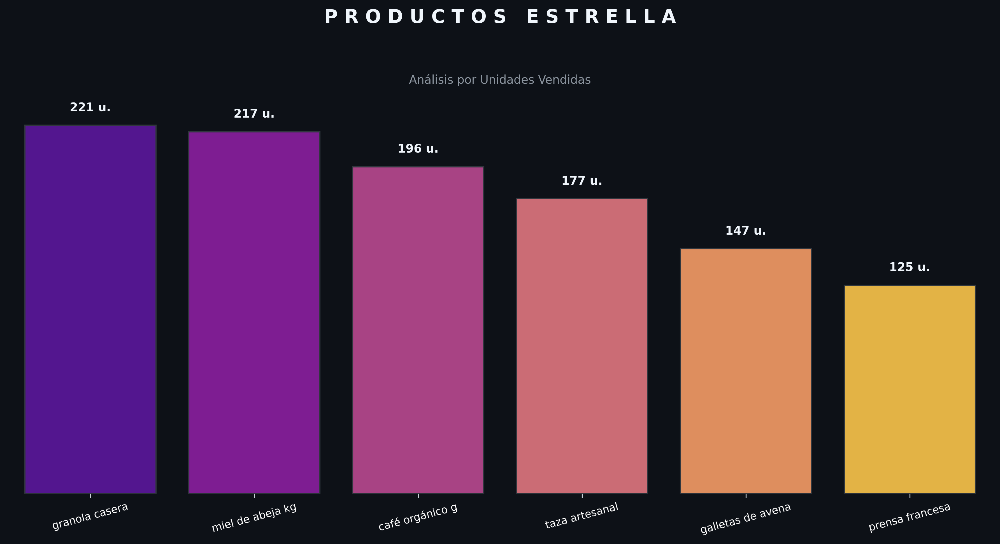

# 📊 Sistema Inteligente de Análisis de Ventas para MIPYMES

Este proyecto demuestra una solución profesional de punta a punta para la gestión y visualización de datos de ventas en pequeñas y medianas empresas (MIPYMES). Transforma datos "sucios" y desestructurados en una base de datos relacional sólida y un reporte visual de alto impacto ejecutivo.

### Reporte de Ventas por Cliente

### Reporte de Productos Estrella

### 🚀 Dashboard Interactivo (Fase 2)
¡Ahora el proyecto cuenta con una aplicación web interactiva! Puedes filtrar datos por fecha, ver KPIs en tiempo real y explorar los datos de forma dinámica.

## 🎯 Problema a Resolver
Las MIPYMES suelen gestionar sus ventas en archivos inconsistentes con nombres de clientes duplicados, formatos de fecha variados y errores de captura. Este proyecto automatiza la limpieza y unificación de dichos datos.

## ⚙️ Características Técnicas

- **ETL (Extracción, Transformación y Carga):** Limpieza de fechas, estandarización de moneda y saneamiento de texto.
- **Motor de Base de Datos:** Migración a **SQLite3** con un modelo relacional (Clientes, Productos, Ventas).
- **Calidad de Datos (Fuzzy Matching):** Uso de algoritmos de similitud de texto para unificar clientes duplicados (ej: "Maria G." y "Maria Garcia").
- **Visualización Ejecutiva:** Generación de un reporte premium en **Modo Oscuro** optimizado para presentaciones.

## 🚀 Cómo Ejecutarlo

El proyecto sigue un orden lógico:

1. `python etl_limpieza.py`: Limpia los datos de `datos_origen.csv`.
2. `python db_motor.py`: Crea la base de datos `negocio_mipyme.db`.
3. `python calidad_datos.py`: Sanea duplicados por similitud.
4. `python generar_reporte.py`: Genera gráficos estáticos.
5. `streamlit run app_dashboard.py`: **Lanza el Dashboard Interactivo en tu navegador.**

## 🛠️ Tecnologías Usadas
- **Python 3**
- **Pandas** (Procesamiento de datos)
- **Matplotlib & Seaborn** (Visualización avanzada)
- **SQLite3** (Gestión de base de datos)
- **Difflib** (Algoritmos de similitud)

---
*Este proyecto es parte de mi Portfolio de Ciencia de Datos Aplicada.*
